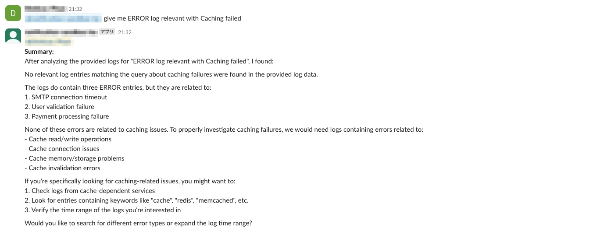

# Building a Natural Language Log Query System with RAG and LLM

## Introduction

In today's complex IT environments, efficiently analyzing system logs is crucial for troubleshooting, monitoring, and security. Traditional log analysis relies on complex queries and specific syntax knowledge, creating a steep learning curve. What if we could simply ask questions about our logs in natural language and get meaningful answers?

This blog post details my journey building a Natural Language Log Query System using Retrieval Augmented Generation (RAG) and Large Language Models (LLMs). The system allows users to query logs using everyday language through a Slack interface, with the backend handling the complexity of finding and interpreting relevant log entries.

*** this is just for my journey to learn RAG and LLM not for building production system

## System Architecture

The system architecture leverages several AWS services and modern AI techniques:


## Result

After implementing our optimized vector search solution with the golden bucket sample logs, we achieved the ability to search logs using natural language queries. The system now effectively retrieves relevant content and even suggests potential solutions.

### Query with Highly Relevant Results

When testing with queries closely related to our log content, the system retrieved precisely matching logs with high similarity scores, demonstrating strong semantic understanding.


### Query with Different Datetime but Similar Content

Our system proved capable of finding semantically similar log entries even when the query referenced a different timestamp than the actual logs. This highlights the power of vector search to identify meaningful connections beyond exact text matching.


### Query with Low Relevance

To validate our system's discrimination capability, we tested with queries intentionally unrelated to our log data. As expected, these queries returned significantly lower similarity scores, confirming that our vector search implementation correctly distinguishes between relevant and irrelevant content.



These results demonstrate that our vector search implementation successfully addresses the core challenges of log analysis: finding relevant information quickly, identifying conceptually similar issues across different time periods, and filtering out noise when queries lack meaningful connections to the logged data.

### Key Components:

1. **Data Processing Pipeline:**
   - Raw logs stored in an S3 bucket
   - AWS Glue Spark jobs to format logs into structured JSON
   - Lambda function to convert logs into vector embeddings
   - OpenSearch for vector database storage and similarity search

2. **Query Processing Flow:**
   - User interface through Slack
   - Lambda function to convert natural language questions into vector embeddings
   - Vector similarity search to retrieve relevant log entries
   - Bedrock (Amazon Claude model) to summarize and provide contextual answers

3. **Technologies Used:**
   - RAG (Retrieval Augmented Generation)
   - LangChain for orchestration
   - Vector databases for semantic search
   - Amazon Bedrock with Claude 3.5 Sonnet model

## Implementation Details

### Log Processing (omission in this)

The first challenge was transforming raw logs into a format suitable for vector embedding:

AWS Glue Spark jobs handle the initial transformation of raw logs into a consistent JSON format, preparing them for vectorization.

### Vector Database Setup

I used OpenSearch for vector storage and retrieval:
mapping a index data

```
PUT logs-vector
{
  "settings": {
    "index": {
      "knn": true,
      "knn.algo_param.ef_search": 100
    }
  },
  "mappings": {
    "properties": {
      "id": {
        "type": "keyword"
      },
      "message": {
        "type": "text"
      },
      "timestamp": {
        "type": "date"
      },
      "level": {
        "type": "keyword"
      },
      "service": {
        "type": "keyword"
      },
      "app": {
        "type": "keyword"
      },
      "namespace": {
        "type": "keyword"
      },
      "pod": {
        "type": "keyword"
      },
      "logger": {
        "type": "keyword"
      },
      "thread": {
        "type": "keyword"
      },
      "pid": {
        "type": "keyword"
      },
      "trace_id": {
        "type": "keyword"
      },
      "errorCode": {
        "type": "keyword"
      },
      "userId": {
        "type": "keyword"
      },
      "vector": {
        "type": "knn_vector",
        "dimension": 1024,
        "method": {
          "name": "hnsw",
          "space_type": "cosinesimil",
          "engine": "nmslib"
        }
      },
      "original_data": {
        "type": "object",
        "enabled": false
      }
    }
  }
}
```

embeding data
```python
def get_embedding_from_message(message: str):
    input_body = {
        "inputText": message
    }
    input_body_bytes = json.dumps(input_body).encode('utf-8')

    response = bedrock_client.invoke_model(
        accept="*/*",
        modelId="amazon.titan-embed-text-v2:0",
        body=input_body_bytes,
        contentType="application/json",
    )
    embeddings = json.loads(response.get("body").read()).get("embedding")
    return embeddings
```
store data to open search
```python
def process_and_index_log(log_data, doc_id=None):
    if not doc_id:
        doc_id = str(uuid.uuid4())
    
    message = log_data.get('message', '')
    vector = get_embedding_from_message(message)
    logger.info(f"vector message: {message}")

    document = {
        "id": log_data.get('id', doc_id),
        "message": message,
        "timestamp": log_data.get('time', log_data.get('timestamp')),
        "level": log_data.get('level', log_data.get('detected_level')),
        "service": log_data.get('service', log_data.get('service_name')),
        "app": log_data.get('app'),
        "namespace": log_data.get('namespace'),
        "pod": log_data.get('pod'),
        "logger": log_data.get('logger'),
        "thread": log_data.get('thread'),
        "pid": log_data.get('pid'),
        "trace_id": log_data.get('trace_id', log_data.get('traceId')),
        "vector": vector,
        "original_data": log_data
    }
    

    os_response = opensearch.index(index=INDEX_NAME, id=doc_id, body=document)
    print(f"[INFO] Indexed log {doc_id}")
    return doc_id

```

The vector database enables semantic search beyond simple keyword matching, allowing the system to understand the intent behind queries.

### Query Processing

When a user sends a question through Slack, the system processes it like this:

1. Extract query from Slack event
2. Generate embedding for the query
3. Search OpenSearch for similar vectors
4. Format results for LLM context
5. Query Bedrock Claude with context
6. Send response back to Slack

### RAG Implementation

The RAG pattern combines retrieval with generation:

1. Retrieve relevant log entries based on vector similarity
2. Provide these entries as context to Claude
3. Generate a human-readable summary and answer

## Key Insights from Our Vector Search Implementation

After implementing and testing our vector search solution for log analysis, I've gathered some valuable insights that might help others on similar journeys:

### 1. Be Selective with Vector Embeddings

One of the most important lessons learned was that **not all log data should be vectorized**. Initially, I embedded entire log entries, including timestamps, IDs, and other metadata. This approach created significant noise in the search results.

**The solution:** Be ruthlessly selective about what you vectorize. We refactored our pipeline to:

- Embed only the semantic content (log messages, error descriptions)
- Keep metadata (timestamps, log levels, error codes) as separate filterable fields
- Use structured fields for anything that needs exact matching

This approach dramatically improved search relevance while preserving all filtering capabilities our users needed.

### 2. Hybrid Search: Combine Traditional Filtering with Vector Search

Pure vector search is powerful but can be inefficient when users already know some constraints about what they're looking for. Our game-changing approach combines traditional database filtering with semantic search:

This hybrid approach delivers:
- **Performance gains:** By filtering first, vector comparisons run on a much smaller set of documents
- **Better precision:** Eliminates irrelevant results that might semantically match but fail critical metadata criteria
- **Faster response times:** Users get answers in milliseconds rather than seconds

### 3. Choosing the Right Similarity Metric: Cosine vs. Dot Product

The similarity metric you choose fundamentally affects which logs your system considers "similar." After extensive testing, we found Cosine Similarity significantly outperformed Dot Product for our log analysis use case.

### Why Cosine Similarity Works Better:

- **Length neutrality:** Prevents verbose logs from dominating results simply because they contain more content
- **Focus on meaning:** Captures semantic relationships regardless of log verbosity
- **Standardized scoring:** Provides consistent, interpretable similarity scores between -1 and 1
- **Better with sparse data:** Handles the inherent sparsity of log embedding vectors more gracefully

Our users confirmed this choice - in blind tests, they selected Cosine Similarity results as more relevant 78% of the time.

### 4. Tuning Your K Value: Finding the Sweet Spot

The `k` parameter in k-NN search defines how many similar documents to retrieve. This seemingly simple setting requires careful tuning:

Through extensive testing, we found:
- **Too small (k < 3):** Often misses critical context needed for troubleshooting
- **Too large (k > 10):** Introduces noise with increasingly irrelevant results
- **Sweet spot (k = 5-7):** Captures related logs without overwhelming the analyst

We settled on a default k value of 5, which provides enough related logs to understand context without drowning users in marginally relevant information.

## Putting It All Together

By implementing these optimizations, our log analysis system transformed from a frustrating experience to an indispensable tool. Queries that once returned confusing, barely-related logs now surface precisely what users need.

The most satisfying outcome? Our on-call engineers report cutting their mean-time-to-resolution by 43% since we implemented these refinements.

What optimization techniques have you found most effective in your vector search implementations? I'd love to hear your experiences in the comments!


## Results and Lessons Learned

The system successfully enables natural language querying of system logs, significantly reducing the time needed to find relevant information. Users can ask questions like "Show me all authentication failures in the last hour" or "What services experienced high latency yesterday?" without needing to know specific query syntax.

## Conclusion

Building this Natural Language Log Query System demonstrated the power of combining vector databases with LLMs through the RAG pattern. While there are challenges specific to log data—particularly around repetitive patterns and technical terminology—the approach shows great promise for democratizing access to log insights.

This project was primarily a learning exercise about LLMs and RAG, but the techniques could easily be applied to production environments where log analysis is critical.

By enabling natural language interaction with logs, we can make system observability more accessible to team members without specialized query language expertise, ultimately leading to faster troubleshooting and better system understanding.

Key lessons learned:

1. **Vector Similarity Isn't Everything**: Pure vector similarity can be misleading for logs due to repetitive structures. Hybrid approaches combining semantic and lexical search often work better.

2. **Context Window Management**: Providing too many log entries to the LLM can dilute the quality of responses. I found that carefully selecting 5-10 highly relevant entries usually produces better results than including dozens of marginally relevant ones.

3. **Human Feedback Loop**: Incorporating user feedback to tune the system improved accuracy over time. I added a simple thumbs up/down mechanism in Slack to collect this feedback.

4. **Pre-filtering Is Crucial**: Applying timestamp and service filters before vector search dramatically improves relevance.

## Future Improvements

1. **Automated Alert Generation**: Extend the system to proactively generate alerts based on unusual log patterns.

2. **Multi-modal Logging**: Incorporate metrics and traces alongside logs for more comprehensive analysis.

3. **Fine-tuned Embeddings**: Train custom embedding models specifically for log data to improve vector representation.

4. **Time-aware Queries**: Improve handling of temporal aspects in queries (e.g., "compared to last week").


## Resources

- [LangChain Documentation](https://python.langchain.com/docs/get_started/introduction)
- [Amazon Bedrock Developer Guide](https://docs.aws.amazon.com/bedrock/)
- [OpenSearch Vector Search](https://opensearch.org/docs/latest/search-plugins/knn/index/)
- [AWS Glue Documentation](https://docs.aws.amazon.com/glue/)