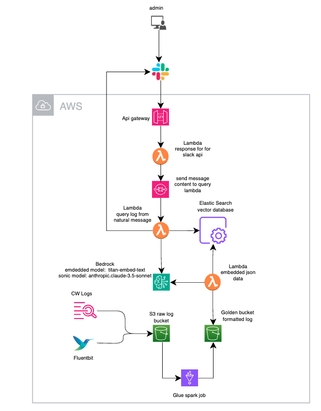
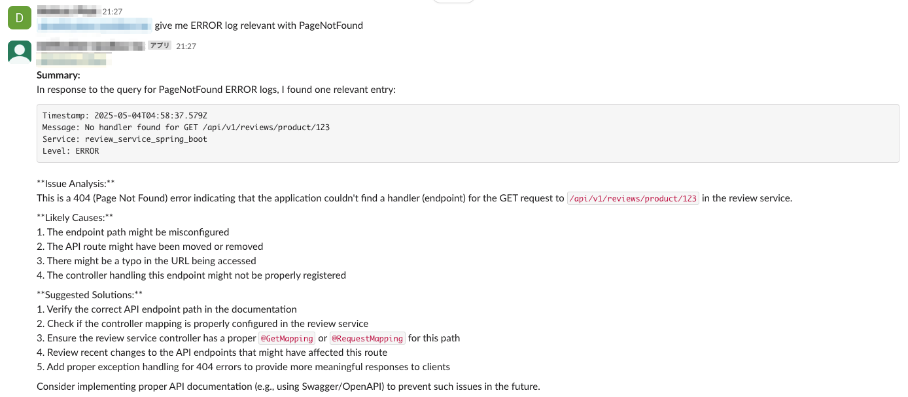
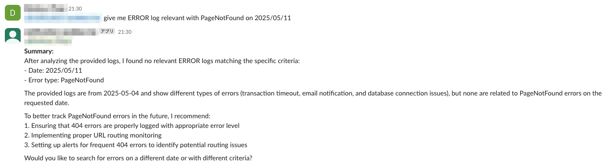

# RAGとLLMを使用した自然言語ログクエリシステムの構築

## はじめに

現在の複雑なIT環境では、システムログを効率的に分析することがトラブルシューティング、モニタリング、セキュリティにとって非常に重要です。従来のログ分析は複雑なクエリと特定の構文知識に依存しており、学習曲線が急峻です。ログについて自然言語で質問し、意味のある回答を得られたらどうでしょうか？

このブログ記事では、検索拡張生成（RAG）と大規模言語モデル（LLM）を使用した自然言語ログクエリシステムを構築した私の旅を詳しく説明します。このシステムにより、ユーザーはSlackインターフェースを通じて日常言語でログをクエリでき、バックエンドが関連するログエントリを見つけて解釈する複雑さを処理します。

***これは本番システムの構築ではなく、RAGとLLMを学ぶための私の旅のためだけのものです

## システムアーキテクチャ

システムアーキテクチャはいくつかのAWSサービスと最新のAI技術を活用しています：



## 結果

ゴールデンバケットのサンプルログで最適化されたベクトル検索ソリューションを実装した結果、自然言語を使用してログを検索する能力を実現しました。現在、システムは関連コンテンツを効果的に取得し、解決策も提案します。

### 高い関連性を持つクエリ結果

ログコンテンツに密接に関連するクエリをテストした場合、システムは高い類似性スコアで正確に一致するログを取得し、強力な意味理解を示しました。



### 異なる日時の類似コンテンツのクエリ

当システムは、クエリが実際のログとは異なるタイムスタンプを参照していても、意味的に類似したログエントリを見つける能力を証明しました。これは、正確なテキスト一致を超えて意味のある接続を識別するベクトル検索の力を示しています。



### 関連性の低いクエリ

システムの識別能力を検証するために、意図的にログデータに関連しないクエリをテストしました。予想通り、これらのクエリは大幅に低い類似性スコアを返し、ベクトル検索の実装が関連コンテンツと無関係なコンテンツを正しく区別することを確認しました。


これらの結果は、ベクトル検索の実装がログ分析の中核的な課題に成功して対処していることを示しています：関連情報を迅速に見つけること、異なる時間帯にわたって概念的に類似した問題を特定すること、クエリがログデータと意味のある接続を欠いている場合にノイズをフィルタリングすることです。

### 主要コンポーネント：

1. **データ処理パイプライン：**
   - S3バケットに保存された生ログ
   - 構造化JSONにログをフォーマットするAWS Glue Sparkジョブ
   - ログをベクトル埋め込みに変換するLambda関数
   - ベクトルデータベースストレージと類似性検索のためのOpenSearch

2. **クエリ処理フロー：**
   - Slackを通じたユーザーインターフェース
   - 自然言語の質問をベクトル埋め込みに変換するLambda関数
   - 関連するログエントリを取得するベクトル類似性検索
   - コンテキストの要約と提供のためのBedrock（Amazon Claudeモデル）

3. **使用技術：**
   - RAG（検索拡張生成）
   - オーケストレーションのためのLangChain
   - 意味検索のためのベクトルデータベース
   - Embeded model: amazon titan text embeddings v2
   - Claude 3.5 Sonnetモデルを搭載したAmazon Bedrock

## 実装の詳細

### ログ処理（ここでは省略）

最初の課題は、生ログをベクトル埋め込みに適した形式に変換することでした：

AWS Glue Sparkジョブは、生ログを一貫したJSON形式に初期変換し、ベクトル化の準備をします。

### ベクトルデータベースのセットアップ

ベクトルの保存と取得にはOpenSearchを使用しました：
インデックスデータのマッピング

```
PUT logs-vector
{
  "settings": {
    "index": {
      "knn": true,
      "knn.algo_param.ef_search": 100
    }
  },
  "mappings": {
    "properties": {
      "id": {
        "type": "keyword"
      },
      "vector": {
        "type": "knn_vector",
        "dimension": 1024,
        "method": {
          "name": "hnsw",
          "space_type": "cosinesimil",
          "engine": "nmslib"
        }
      },
      "original_data": {
        "type": "object",
        "enabled": false
      }
    }
  }
}
```

データの埋め込み
```python
def get_embedding_from_message(message: str):
    input_body = {
        "inputText": message
    }
    input_body_bytes = json.dumps(input_body).encode('utf-8')

    response = bedrock_client.invoke_model(
        accept="*/*",
        modelId="amazon.titan-embed-text-v2:0",
        body=input_body_bytes,
        contentType="application/json",
    )
    embeddings = json.loads(response.get("body").read()).get("embedding")
    return embeddings
```
OpenSearchにデータを保存
```python
def process_and_index_log(log_data, doc_id=None):
    if not doc_id:
        doc_id = str(uuid.uuid4())
    
    message = log_data.get('message', '')
    vector = get_embedding_from_message(message)
    logger.info(f"vector message: {message}")

    document = {
        "id": log_data.get('id', doc_id),
        "message": message,
        "timestamp": log_data.get('time', log_data.get('timestamp')),
        "level": log_data.get('level', log_data.get('detected_level')),
        "service": log_data.get('service', log_data.get('service_name')),
        "app": log_data.get('app'),
        "namespace": log_data.get('namespace'),
        "pod": log_data.get('pod'),
        "logger": log_data.get('logger'),
        "thread": log_data.get('thread'),
        "pid": log_data.get('pid'),
        "trace_id": log_data.get('trace_id', log_data.get('traceId')),
        "vector": vector,
        "original_data": log_data
    }
    

    os_response = opensearch.index(index=INDEX_NAME, id=doc_id, body=document)
    print(f"[INFO] Indexed log {doc_id}")
    return doc_id

```

ベクトルデータベースは単純なキーワードマッチングを超えた意味検索を可能にし、システムがクエリの背後にある意図を理解できるようにします。

### クエリ処理

ユーザーがSlackを通じて質問を送信すると、システムは次のように処理します：

1. Slackイベントからクエリを抽出
2. クエリの埋め込みを生成
3. 類似ベクトルのOpenSearchを検索
4. LLMコンテキスト用に結果をフォーマット
5. コンテキストでBedrock Claudeにクエリ
6. レスポンスをSlackに送り返す

### RAG実装

RAGパターンは検索と生成を組み合わせます：

1. ベクトル類似性に基づいて関連するログエントリを取得
2. これらのエントリをClaudeのコンテキストとして提供
3. 人間が読める要約と回答を生成

## ベクトル検索実装からの主な洞察

ログ分析のためのベクトル検索ソリューションを実装してテストした後、他の人の旅に役立つかもしれない貴重な洞察をいくつか集めました：

### 1. ベクトル埋め込みの選択的使用

学んだ最も重要な教訓の1つは、**すべてのログデータをベクトル化すべきではない**ということでした。最初、タイムスタンプ、ID、その他のメタデータを含むログエントリ全体を埋め込みました。このアプローチは検索結果に大きなノイズを生み出しました。

**解決策：** ベクトル化する対象について厳選する必要があります。パイプラインを次のように再構築しました：

- 意味的なコンテンツ（ログメッセージ、エラーの説明）のみを埋め込む
- メタデータ（タイムスタンプ、ログレベル、エラーコード）を別のフィルタリング可能なフィールドとして保持
- 完全一致が必要なものには構造化フィールドを使用

このアプローチにより、ユーザーが必要とするすべてのフィルタリング機能を維持しながら、検索の関連性が劇的に向上しました。

### 2. ハイブリッド検索：従来のフィルタリングとベクトル検索の組み合わせ

純粋なベクトル検索は強力ですが、ユーザーが探しているものに関する制約をすでに知っている場合、非効率的になる可能性があります。私たちの画期的なアプローチは、従来のデータベースフィルタリングと意味検索を組み合わせています：

このハイブリッドアプローチは以下を提供します：
- **パフォーマンス向上：** 最初にフィルタリングすることで、ベクトル比較はより小さなドキュメントセットで実行される
- **より良い精度：** 意味的に一致するが重要なメタデータ基準を満たさない無関係な結果を排除
- **より速いレスポンス時間：** ユーザーは数秒ではなくミリ秒で回答を得る

### 3. 適切な類似性メトリックの選択：余弦類似度 vs ドット積

選択する類似性メトリックは、システムがどのログを「類似」と見なすかに根本的に影響します。広範なテスト後、ログ分析のユースケースでは余弦類似度がドット積を大幅に上回ることがわかりました。

### 余弦類似度がより良い理由：

- **長さの中立性：** 冗長なログが単に多くのコンテンツを含むという理由で結果を支配することを防ぐ
- **意味に焦点：** ログの冗長性に関係なく意味的関係をキャプチャする
- **標準化されたスコアリング：** -1から1の間で一貫性があり解釈可能な類似性スコアを提供
- **スパースデータでの優位性：** ログ埋め込みベクトルの固有のスパース性をよりうまく処理する

ユーザーはこの選択を確認しました - ブラインドテストでは、余弦類似度の結果が78％の時間でより関連性が高いと選択されました。

### 4. Kの値の調整：最適なポイントの発見

k-NN検索の`k`パラメータは、取得する類似ドキュメントの数を定義します。一見単純に見えるこの設定は慎重な調整が必要です：

広範なテストを通じて、以下がわかりました：
- **小さすぎる（k < 3）：** トラブルシューティングに必要な重要なコンテキストを見逃すことがよくある
- **大きすぎる（k > 10）：** 関連性が低下する結果でノイズが増加する
- **最適値（k = 5-7）：** アナリストを圧倒することなく関連ログをキャプチャする

私たちはデフォルトのk値を5に設定し、これによりユーザーを関連性の低い情報で圧倒することなく、コンテキストを理解するのに十分な関連ログが提供されます。

## すべてをまとめる

これらの最適化を実装することで、ログ分析システムはフラストレーションの経験から不可欠なツールへと変貌しました。以前は混乱し、ほとんど関連のないログを返していたクエリが、現在ではユーザーが必要とするものを正確に表示します。

最も満足のいく結果は何でしょうか？オンコールエンジニアがこれらの改良を実装して以来、平均解決時間が43％短縮されたと報告しています。

ベクトル検索実装でどのような最適化技術が最も効果的だと感じましたか？コメントであなたの経験をぜひ聞かせてください！

## 結果と学んだ教訓

このシステムは、システムログの自然言語クエリを正常に可能にし、関連情報を見つけるのに必要な時間を大幅に短縮します。ユーザーは特定のクエリ構文を知る必要なく、「過去1時間の認証失敗をすべて表示して」や「昨日高いレイテンシを経験したサービスは何か？」などの質問をすることができます。

## 結論

この自然言語ログクエリシステムの構築は、RAGパターンを通じてベクトルデータベースとLLMを組み合わせる力を示しました。繰り返しパターンや技術用語に関連するログデータ特有の課題がありますが、このアプローチはログインサイトへのアクセスを民主化するための大きな可能性を示しています。

ログとの自然言語インタラクションを可能にすることで、専門的なクエリ言語の専門知識がないチームメンバーにもシステムの可観測性をより身近なものにし、最終的にはより速いトラブルシューティングとシステムのより良い理解につながります。

このプロジェクトは主にLLMとRAGについての学習演習でしたが、LLMの理解と活用において大きな一歩を踏み出すことができたと思います。


学んだ主な教訓：

1. **ベクトル類似性だけがすべてではない**: 繰り返し構造のためにログの純粋なベクトル類似性は誤解を招く可能性があります。意味的な検索と字句的な検索を組み合わせたハイブリッドアプローチがしばしばより効果的です。

2. **コンテキストウィンドウ管理**: LLMに多すぎるログエントリを提供すると、レスポンスの品質が低下する可能性があります。5〜10個の高関連エントリを慎重に選択すると、わずかに関連する数十のエントリを含めるよりも通常良い結果が得られることがわかりました。

3. **人間のフィードバックループ**: システムを調整するためのユーザーフィードバックを組み込むことで、時間とともに精度が向上しました。このフィードバックを収集するために、Slackに簡単な親指アップ/ダウンメカニズムを追加しました。

4. **事前フィルタリングが重要**: ベクトル検索の前にタイムスタンプとサービスフィルターを適用すると、関連性が劇的に向上します。

## 将来の改善
1. **アーキテクチャー IAC化**: 今後、アーキテクチャーをTerraformで管理していく。

2. **自動アラート生成**: 異常なログパターンに基づいてプロアクティブにアラートを生成するようにシステムを拡張する。

3. **マルチモーダルロギング**: より包括的な分析のためにログと共にメトリクスとトレースを組み込む。

4. **微調整された埋め込み**: ベクトル表現を改善するためにログデータ専用のカスタム埋め込みモデルをトレーニングする。

5. **時間認識クエリ**: クエリの時間的側面（例：「先週と比較して」）の処理を改善する。

## リソース

- [LangChainのドキュメント](https://python.langchain.com/docs/get_started/introduction)
- [Amazon Bedrockデベロッパーガイド](https://docs.aws.amazon.com/bedrock/)
- [OpenSearch ベクトル検索](https://opensearch.org/docs/latest/search-plugins/knn/index/)
- [AWS Glueのドキュメント](https://docs.aws.amazon.com/glue/) 